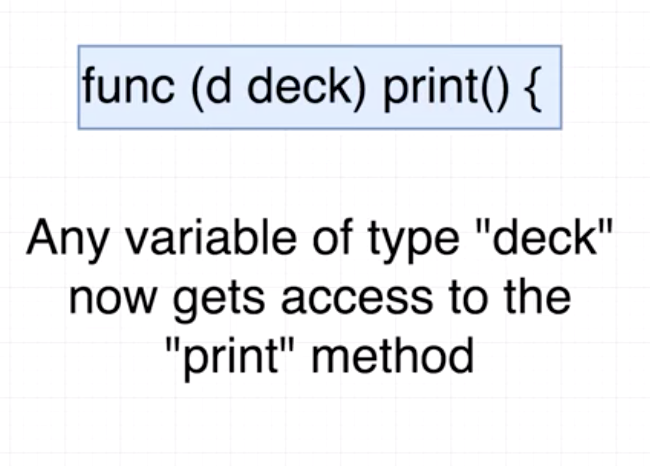

### How variables are named

### Fundamental data types

### Return value

### Array vs Slice

An array has a fixed length whereas as a slice has a variable length

Both slices and arrays must be declared with a specific data type. Ie every element in a slice must be of the same type

### Declaring and appending slices

### for loops

- index = index of the element in the list/array
- card = current card we are iterating over
- range cards = Here is a slice of records. This is a key word that will be used to iterate over records.

---

### Cards - OO Approach

In OOP we would create a Deck Class blueprint to create a deck instance. That instance would have some data and functions built into it in order to manipulate the data in the instnace.

Go is 'significantly different'. Instead of classes to create the deck we will be creating a new type inside of Go by extending a base type and adding extra functionality to it. Therefore the data type we will be extending is the slice of strings. The extra functionality we will be adding to the new type will be a function with a receiver, this is a fucntion that belongs to an instance ( Similar to a method on an instance in OOP ).

#### What is a receiver?

The ( d deck ) is known as the receiver. It is of type deck and the function name is print. Because the receiver is in there, any variable of type deck now gets access to the print method. The purpose of the receiver is to setup methods on types we create.

This is a further explanation of the receiver. The "d" is the reference to the working variable. WE can think of it as the actual copy of the deck type. The "d" argument can be thought of as "this"/"self". Convention is to name it the first letter of the name of the "type" we are creating. In this case we are creating a deck. Therefore it is called "d" in this case.

### Getting rid of extra variables like "i" or "j" in for loops

Go doesnt let you compile / run your file if you have unused variables. This means that You will either have to use them or get rid of them. To get rid of them all you need to do is replace them with a "\_". This means communicates to Go that you acknoledge that there is meant to be a variable there but we dont have a use for it.

---

### Slices

Like Python Go has an index system for arrays and slices. Starting at zero and then the last index. Therefore you can access the second element of the slice with `name_of_slice[1]`

To access a range of elements in a slice work as the below diagram. The first number refers to the first element that will be included in the range _Inclusive_. The last element is the stopping point of the range ie. it is up to this point but not including it _up to but not including_

Shorthand:

- `fruits[:3]` This means from the very beginning of the slice to the 3rd element
- `fruits[3:]` This means from the 3rd element of the slice to the very end

### Multiple returns

Functions can have multiple return values. Remember to declare both return types in the fuction definition and then also have both return values separated by a comma.

When a multiple return function is called it returns multiple values which means we need to assign them. The blow example is done simultaniously.

---

### Working with the ioutil package

This package allows us to write to a new or existing file on our HD.

`func WriteFile(filename string, data []byte, perm os.FileMode) error`

`filename string` refers to the name of the file we will be writing to. Sype string
`data []byte` refers to raw data we want to save. A slice of bytes.
`perm` what permissions should we use to create this file if we need to create it

### What is a byte slice?!

A byte slice is an ascii representation of the values of the string/int. It is a more "computer friendly" way of communicating data. However we cannt do this by hand we will probably need a hand converting the data to a byte slice.

### Type conversion with Go

There is an inbuilt function called `[]byte` which will convert data to a byte slice. However this function takes string. Therefore we will change the data to one string and then convert that string to a byte slice.

We will be converting an instance of the deck type to one single string. This is possible becasue the deck type was origonally just an extension of the slice type that contained only strings. We will use the func Join method to do this, this is part of the stings package.

`func Join(elems []string, sep string) string`

---

### The error type

There is a specific error type in Go. If you coupled this with the previously multiple assignment then you get an elegent line of code like below. Once could immediately move onto control flow based on the error afterwards.

`bs, err := ioutil.ReadFile(filename)`

### The 'os' package

This is a package that gives us access to the underlying os. It will work equally well on any os. The exit function exits the program. Pass in an exit code to show that something went wrong.

### More on strings, the Split function

This will convert one long string separated by commas into a slice of elements.

`s := strings.Split(string(bs), ",")`

### Type conversion to a 'custom type'

Type conversion is pretty straight forward. When we create a custom type we are extending the base type of a slice of strings for example. Therefore we can convert any slice of strings to our custom type because they are effectively the same thing already.
