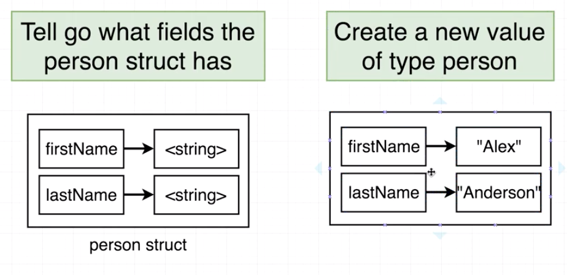
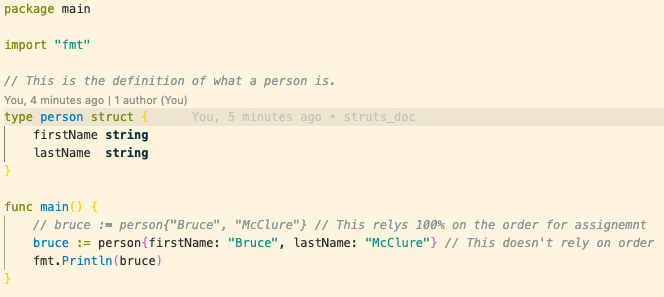
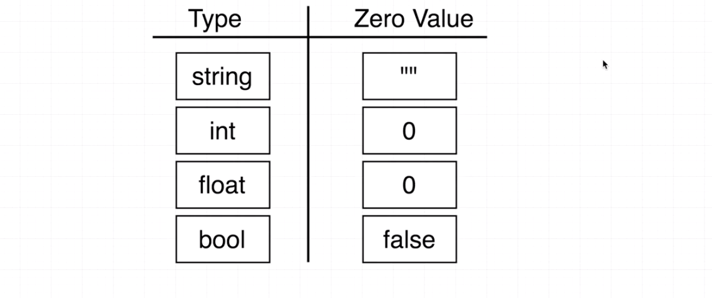

### Declaring struts

For now struts can be thought of as `{ hash: ruby, dict: python, object: js }` There is a little more to it than that but that will do for now. The first thing we need to do is to declare the strut, this includes the name of the strut itself, the names of the 'keys' and the type of values on those keys. This will be known as the person strut in this example. Thereafter we can create new values of type person.

### Updating strut values

### Go zero values

Zero values are provided by default when creating a new object of a strut but you dont provide it with any values. ie `var bruce person`. The zero values provided are dependent of the ype of data that the strut holds. As the table below shows.

