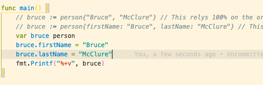
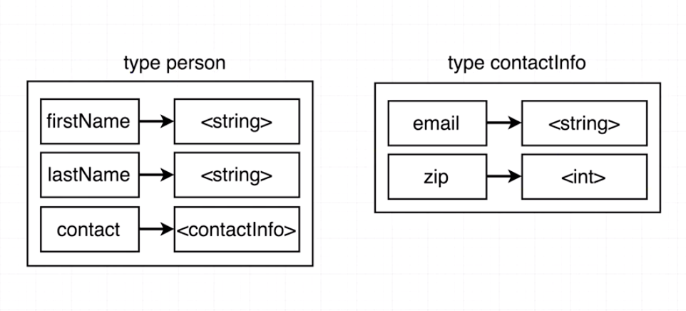
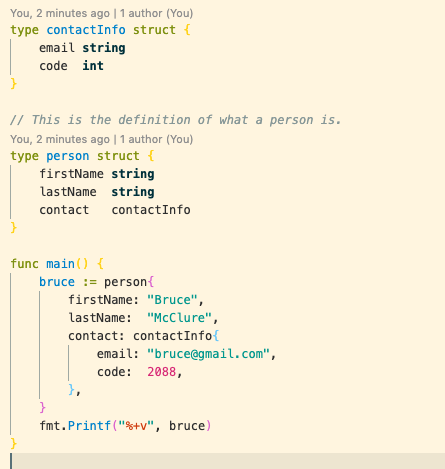

### Declaring structs

For now struts can be thought of as `{ hash: ruby, dict: python, object: js }` There is a little more to it than that but that will do for now. The first thing we need to do is to declare the strut, this includes the name of the strut itself, the names of the 'keys' and the type of values on those keys. This will be known as the person strut in this example. Thereafter we can create new values of type person.

### Go zero values

Zero values are provided by default when creating a new object of a strut but you dont provide it with any values. ie `var bruce person`. The zero values provided are dependent of the ype of data that the strut holds. As the table below shows. To demonstate this lets print out the empty strut with fmt.Printf("%+v", bruce) This will print out the keys and values.

### Updating struct values

Because we now have the default empty values we need to update the values of the strut. This is done in a similar way to other languages. Specify the key and add another vlaue to it.

### Embedding structs

You can next structs inside eachother. This will be seen several times in a similar way to how js nests objects when serving data. For example, we already have our person type and we can add some cantact information onto it. **NB** Something incredibly important to remember if you came from js is that at the end of each element of a strut there needs to be a "," at the end including the ending "}"

